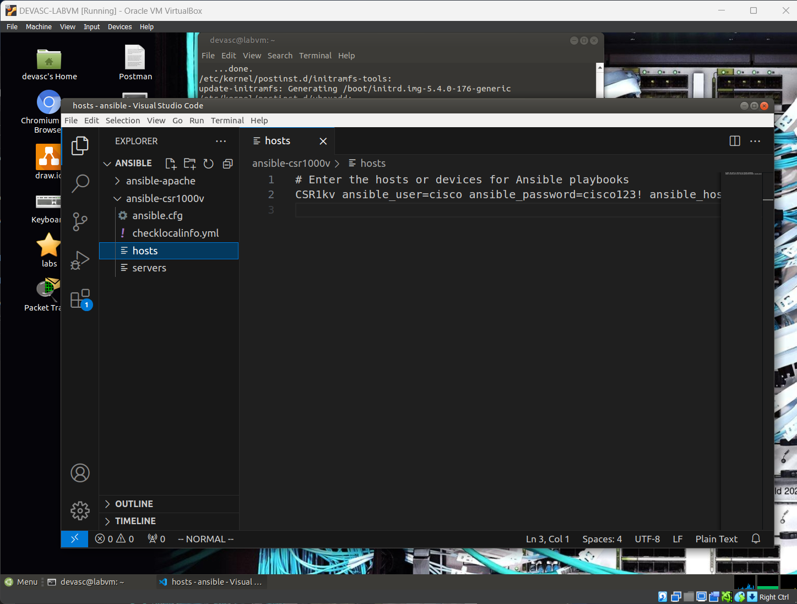
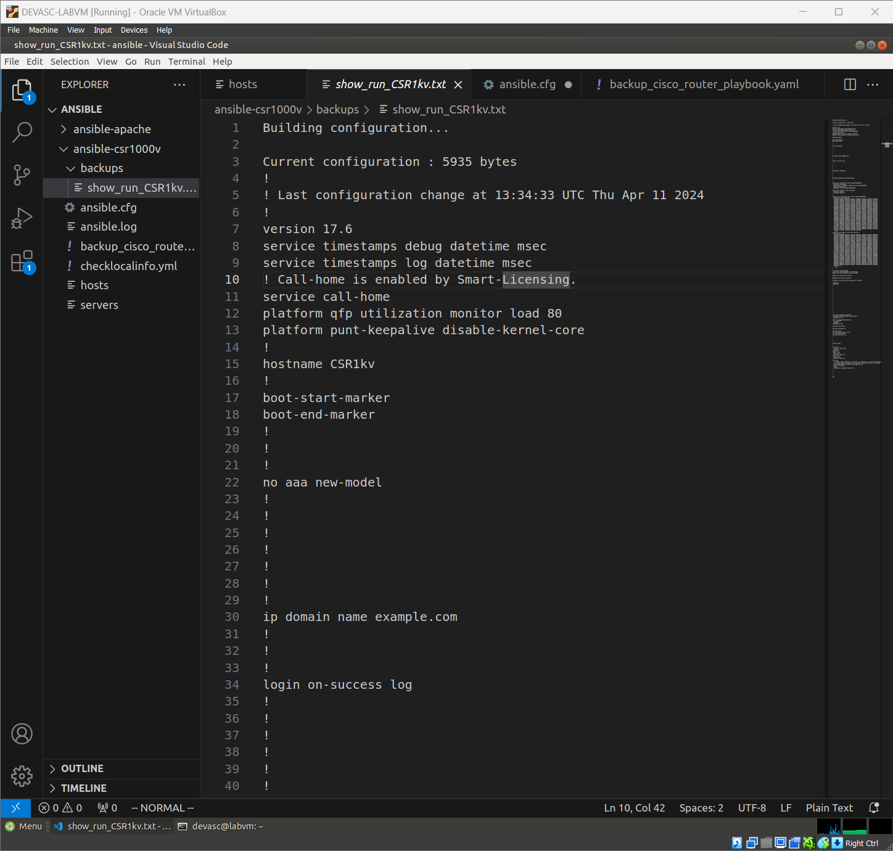
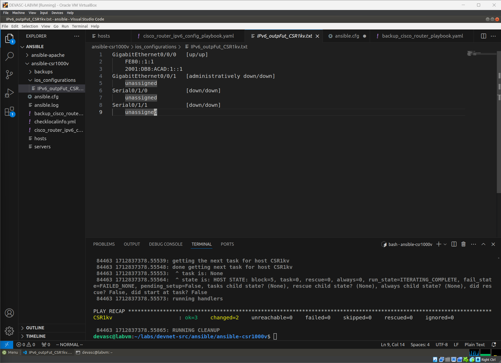
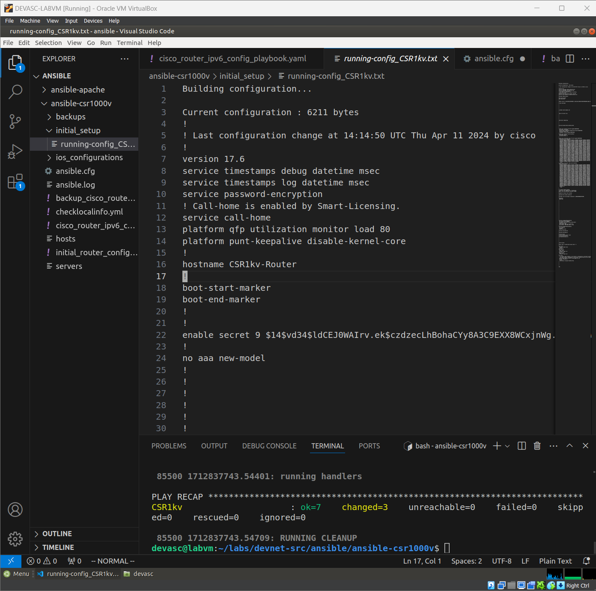

# Discovering Ansible

**Date**: 26-09-2021

I started learning Ansible today. I am excited to learn about this tool. I have heard a lot about it from my colleagues. I hope to become proficient in it soon.

## Topics Covered

1. Introduction to Ansible
2. Ansible Virtual Machines Setup
3. Ansible Playbooks
4. Ansible Modules

## Notes

- Ansible is an open-source automation tool.
- It is used for configuration management, application deployment, and task automation.
- Ansible uses SSH to communicate with remote machines.
- Playbooks are written in YAML and TOML format.

## Tasks

- [x] Install Ansible on my local machine.
- [x] Set up a virtual machine for Ansible practice.
- [x] Connect Ansible to Router.
- [x] Write my first Ansible playbook.

## Labs

### Setting up Virtual Machines

I set up a virtual machine using VirtualBox for Ansible practice. I installed Ubuntu 20.04 LTS on the VM.


Figure 1: Virtual Machine Setup

No difficulties so far. Everything is going smoothly. I am looking forward to exploring more about Ansible.


Figure 2: VSCode

### Connecting Ansible to Router

Firstly, I connected my device with the router. Then, I configured the router to allow SSH connection from my device. I changed the network settings for Ansible to bridge mode, which allowed it to communicate with the router.

I stuck at this point for a while, due to the misconfiguration of the router, I was able to connect to the router but without privilege. I had to configure the router to allow SSH connection with privilege.

### Trying out Ansible Playbooks

The first playbook I tried was a simple one to check running-config on the router. I used the ios_command module to execute the command.

```yaml
---
- name: AUTOMATIC BACKUP OF RUNNING-CONFIG
  hosts: CSR1kv
  gather_facts: false
  connection: local

  vars:
    ansible_become: yes
    ansible_become_method: enable
    ansible_become_password: cisco123!

  tasks:
    - name: DISPLAYING THE RUNNING-CONFIG
      ios_command:
        commands:
          - show running-config
      register: config

    - name: SAVE OUTPUT to ./backups/
      copy:
        content: '{{ config.stdout[0] }}'
        dest: 'backups/show_run_{{ inventory_hostname }}.txt'
```

I ran the playbook using the command `ansible-playbook backup_cisco_router_playbook.yml`. It executed successfully, and I was able to see the running-config of the router saved in the backups folder.


Figure 3: Running Config
At this point I learnt how to debug the playbook using the `-vvv` option. It helped me identify the issues in my playbook and correct them.

### More to Explore

Now that I have successfully executed my first playbook, I am eager to explore more about Ansible. This time is to configure the router using Ansible. I will configure IPv6 on the router using Ansible Playbooks.

```yaml
---
- name: CONFIGURE IPv6 ADDRESSING
  hosts: CSR1kv
  gather_facts: false
  connection: local

  tasks:
    - name: SET IPv6 ADDRESS
      ios_config:
        parents: 'interface GigabitEthernet0/0/0'
        lines:
          - description IPv6 ADDRESS
          - ipv6 address 2001:db8:acad:1::1/64
          - ipv6 address fe80::1:1 link-local

    - name: SHOW IPv6 INTERFACE BRIEF
      ios_command:
        commands: show ipv6 interface BRIEF
      register: output

    - name: SAVE OUTPUT ./ios_configurations/
      copy:
        content: '{{ output.stdout[0] }}'
        dest: 'ios_configurations/IPv6_output_{{ inventory_hostname }}.txt'
```

This time everything went smoothly. I was able to configure the IPv6 addressing on the router using Ansible Playbooks.


Figure 4: IPv6 Configuration

Like the previous playbook, I debugged this one using the `-vvv` option and corrected the issues.

### The Challenge

For the challenge part, I decided to write a playbook that will do the basic configuration for the router.

```yaml
---
- name: Initial Router Configuration Setup and Save Outputs
  hosts: CSR1kv
  gather_facts: false
  connection: network_cli

  tasks:
    - name: Set the Hostname
      ios_config:
        lines:
          - hostname CSR1kv-Router

    - name: Configure Enable Secret Password
      ios_config:
        lines:
          - enable secret 5 $1$vd34$PXrT7P8y4JdNXrHpRq4fE1

    - name: Configure Automatic Encryption for All Passwords
      ios_config:
        lines:
          - service password-encryption

    - name: Create MOTD Banner
      ios_config:
        lines:
          - banner motd $ Authorized Access Only! $

    - name: Show Running Configuration
      ios_command:
        commands:
          - show running-config
      register: show_run

    - name: Save Running Config to Startup Config
      ios_command:
        commands:
          - write memory

    - name: Save Output To File
      copy:
        content: '{{ show_run.stdout[0] }}'
        dest: 'initial_setup/running-config_{{ inventory_hostname }}.txt'
```

Which included:

- Setting the hostname of the router.
- Configuring the enable secret password.
- Enabling automatic encryption for all passwords.
- Creating a MOTD banner.
- Saving the running configuration to the startup configuration.

I ran the playbook using the command `ansible-playbook initial_router_configuration_setup.yml`. It executed successfully, and I was able to see the running-config of the router saved in the initial_setup folder.


Figure 5: Initial Setup

## Conclusion

I had a great time exploring Ansible today. I learned a lot about Ansible playbooks and modules. I am excited to continue my journey with Ansible and explore more advanced topics. I am looking forward to automating more tasks using Ansible.
